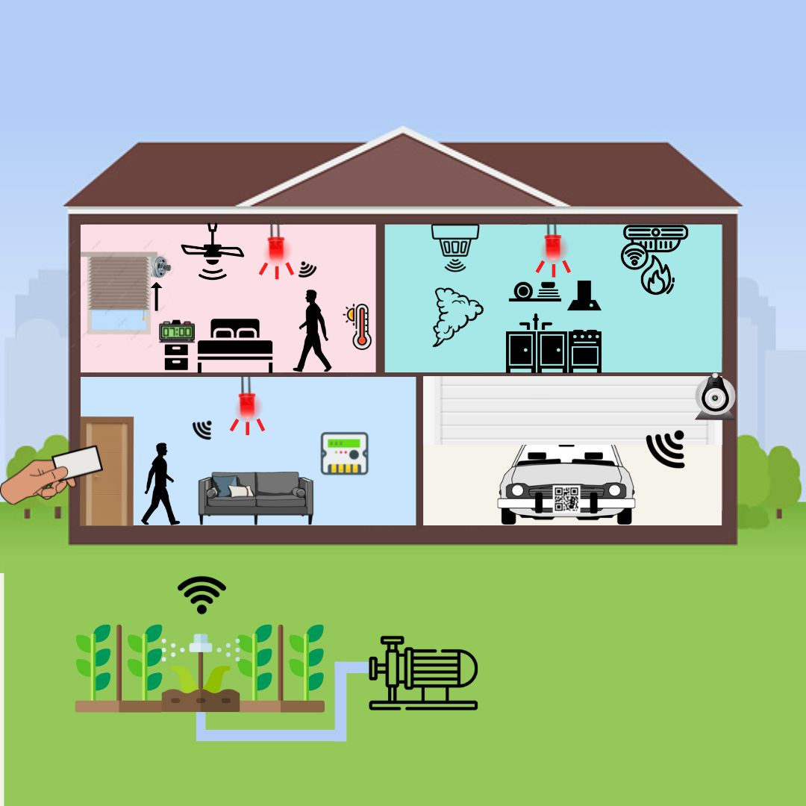
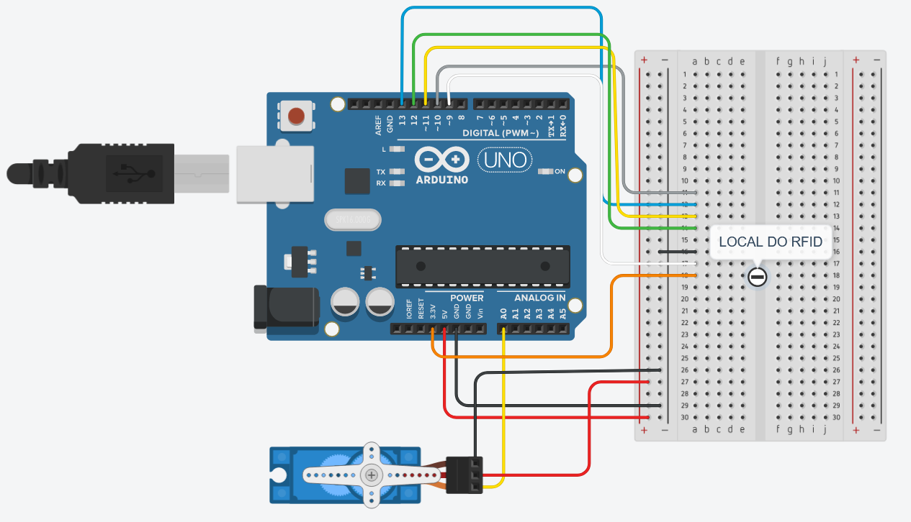
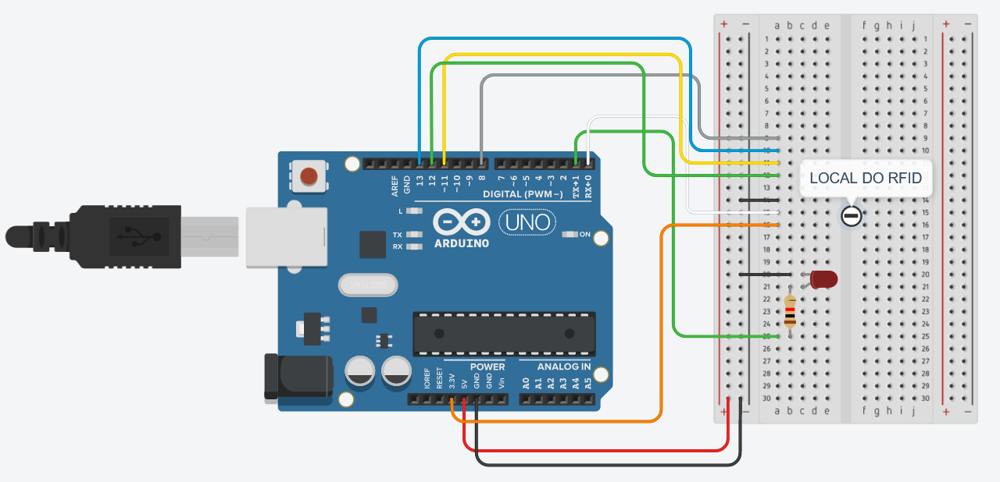
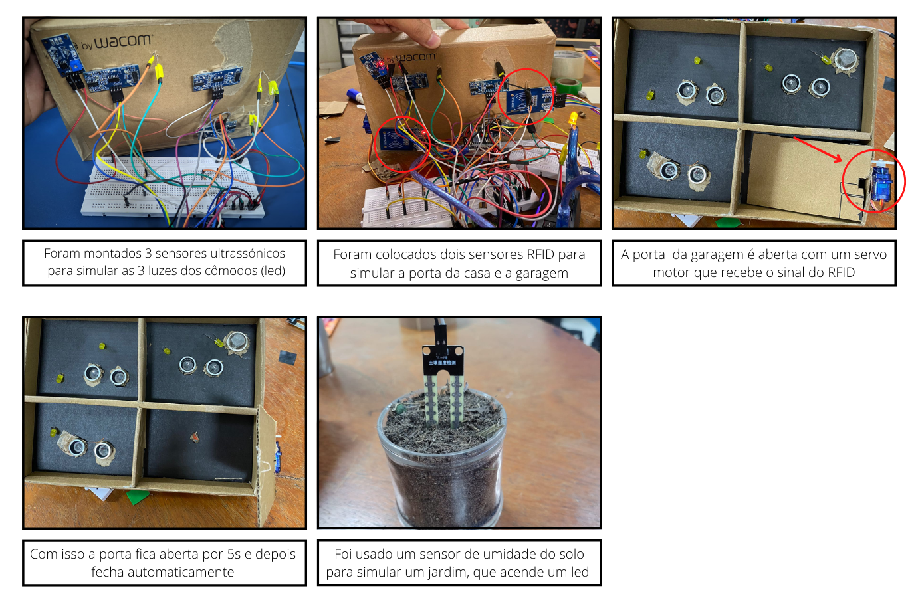

# Casa Inteligente em Miniatura <!-- omit in toc -->

Projeto e implementação de uma maquete de casa inteligente

Equipe formada por:

- [Eduardo Henrique](https://github.com/ed-henrique)
- [Rosialdo Vidinho](https://github.com/Rosialdo)
- [Lucas Ribeiro](https://github.com/LuKasAlvino)
- [Lucas Prado](https://github.com/Lucasx10)

## Índice <!-- omit in toc -->

- [Divisão de Trabalho](#divisão-de-trabalho)
  - [Andamento do Projeto](#andamento-do-projeto)
- [Componentes Necessários](#componentes-necessários)
- [Simulação](#simulação)
- [Storyboard](#storyboard)
- [Testes Realizados](#testes-realizados)
- [Tecnologias Utilizadas](#tecnologias-utilizadas)
- [Como Compilar](#como-compilar)
- [Demonstração](#demonstração)
- [Referências](#referências)
  - [Quarto](#quarto)

## Divisão de Trabalho

| Equipe           | Cômodos         |
| :--------------- | :-------------: |
| Lucas Prado      | Cozinha         |
| Lucas Ribeiro    | Garagem         |
| Rosialdo Vidinho | Sala e Jardim   |
| Eduardo Henrique | Quarto          |

### Andamento do Projeto

| Cômodo  | Documentação | Código | Simulação | Circuito Físico |
| :-----  | :----------: | :----: | :-------: | :-------------: |
| Sala    | - | -  | -  | - |
| Jardim  | - | -  | -  | - |
| Quarto  | - | 👍 | 👍 | - |
| Cozinha | - | 👍 | 👍 | - |
| Garagem | - | -  | -  | - |
|                           |
| Final   | - | -  | -  | - |

## Componentes Necessários

| Componente                       | Quantidade |
| :------------------------------- | :--------: |
| LED (Cores únicas)               | 4          |
| Motor 180                        | 3          |
| Sensor de presença               | 4          |
| Sensor de amperagem não invasivo | 1          |
| Sensor de umidade e temperatura  | 1          |
| Buzzer                           | 1          |
| Detector de chama                | 1          |
| Sensor de gás carbônico          | 1          |
| Sensor RFID                      | 1          |
| Tag RFID                         | 2          |
| Bomba d'água                     | 1          |
| Sensor infravermelho             | 1          |
| Sensor de solo ergométrico       | 1          |
| Jumper macho-fêmea               | X          |
| Jumper macho-macho               | X          |
| Jumper fêmea-fêmea               | X          |
| Arduino Uno                      | 1          |
| Arduino Nano                     | 1          |
| ESP8266 WiFi Module              | 1          |

## Simulação

Realizada no [TinkerCAD](https://www.tinkercad.com/).

- [Arduino uno]()

- [Arduino nano]()

- [ESP 8266]()

## Storyboard

## Testes Realizados

TDD - Test-Driven Development

Máquina de Estados com Métodos Formais

## Tecnologias Utilizadas

- Arduino
- Firebase

## Como Compilar

WIP

## Demonstração

WIP

## Referências

### Quarto

- [Sensor PIR com LED](https://www.instructables.com/PIR-Motion-Sensor-With-Arduino-in-Tinkercad/)
- [Registrando logs em Firebase com Arduino](https://create.arduino.cc/projecthub/electropeak/connecting-arduino-to-firebase-to-send-receive-data-cd8805)
